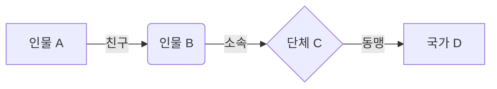

# 09. 관계 설정 템플릿

이 템플릿은 소설 속 인물, 단체, 국가, 지역 등 주요 엔티티들 간의 복잡한 관계를 체계적으로 기록하고 관리하기 위해 사용됩니다. 각 관계는 소설의 플롯, 갈등, 그리고 인물 동기에 중요한 영향을 미치므로, 상세하게 기록하는 것이 중요합니다.

## 1. 주요 엔티티 목록

이 템플릿에서 다룰 주요 엔티티(인물, 단체, 국가, 지역 등)들을 간략히 나열합니다.

- [엔티티 1 이름]: [간략한 설명]
- [엔티티 2 이름]: [간략한 설명]
- ...

## 2. 관계 정의

각 엔티티 쌍에 대해 관계의 유형, 상세 내용, 그리고 관계가 플롯에 미치는 영향을 기록합니다. 필요에 따라 테이블이나 개별 섹션을 활용할 수 있습니다.

### 2.1. 인물 간 관계

| 관계 대상 (인물 A) | 관계 대상 (인물 B) | 관계 유형 (가족, 연인, 친구, 스승-제자, 경쟁자, 적대자 등) | 관계의 상세 내용 및 배경 | 관계가 플롯에 미치는 영향 |
| :----------------- | :----------------- | :------------------------------------------------------- | :----------------------- | :----------------------- |
| [인물 A 이름]      | [인물 B 이름]      | [관계 유형]                                              | [상세 내용]              | [플롯 영향]              |
| ...                | ...                | ...                                                      | ...                      | ...                      |

### 2.2. 인물과 단체/국가 간 관계

| 관계 대상 (인물) | 관계 대상 (단체/국가) | 관계 유형 (소속, 충성, 적대, 이용 등) | 관계의 상세 내용 및 배경 | 관계가 플롯에 미치는 영향 |
| :----------------- | :-------------------- | :------------------------------------ | :----------------------- | :----------------------- |
| [인물 이름]        | [단체/국가 이름]      | [관계 유형]                            | [상세 내용]              | [플롯 영향]              |
| ...                | ...                   | ...                                   | ...                      | ...                      |

### 2.3. 단체/국가 간 관계

| 관계 대상 (단체/국가 A) | 관계 대상 (단체/국가 B) | 관계 유형 (동맹, 전쟁, 경쟁, 협력, 중립 등) | 관계의 상세 내용 및 배경 | 관계가 플롯에 미치는 영향 |
| :---------------------- | :---------------------- | :------------------------------------------ | :----------------------- | :----------------------- |
| [단체/국가 A 이름]      | [단체/국가 B 이름]      | [관계 유형]                                 | [상세 내용]              | [플롯 영향]              |
| ...                     | ...                     | ...                                         | ...                      | ...                      |

### 2.4. 기타 관계 (지역, 개념 등)

위 범주에 속하지 않는 특별한 관계가 있다면 여기에 기록합니다.

*   **[관계 대상 1]과 [관계 대상 2]의 관계:**
    *   **유형:** [관계 유형]
    *   **상세 내용:** [관계의 상세 내용 및 배경]
    *   **플롯 영향:** [관계가 플롯에 미치는 영향]

## 3. 관계 시각화 (선택 사항)

복잡한 관계는 다이어그램이나 그래프로 시각화하면 이해도를 높일 수 있습니다. (예: Mermaid 문법 활용)

