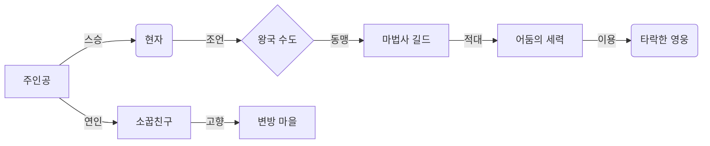

# 05-09. 관계 설정 가이드 (Relationships Guide)

이 가이드는 `09_relationships_template.md`를 활용하여 소설 속 엔티티(인물, 단체, 국가, 지역 등) 간의 복잡한 관계를 체계적으로 설정하고 관리하는 방법을 안내합니다. 잘 정의된 관계는 깊이 있는 세계관을 구축하고, 개연성 있는 플롯을 전개하며, 캐릭터의 동기를 부여하는 데 핵심적인 역할을 합니다.

## 1. 관계 설정의 중요성

*   **세계관의 깊이:** 단순히 개별 엔티티를 나열하는 것을 넘어, 엔티티 간의 상호작용과 역학 관계를 통해 세계관에 생명력을 불어넣습니다.
*   **플롯의 개연성:** 인물과 집단 간의 관계에서 발생하는 갈등, 협력, 배신 등은 자연스러운 사건 전개의 기반이 됩니다.
*   **캐릭터 동기:** 캐릭터의 과거 관계나 현재의 관계가 그들의 행동, 선택, 그리고 성장(또는 몰락)에 강력한 동기를 제공합니다.
*   **설정의 일관성 유지:** 복잡한 관계를 한곳에 기록함으로써, 스토리가 진행됨에 따라 관계 설정이 흔들리거나 모순되는 것을 방지할 수 있습니다.

## 2. 관계 설정 워크플로우

1.  **주요 엔티티 식별:**
    *   `02-1_character_template.md`, `03_regions_template.md`, `04_organizations_template.md`, `05_nations_template.md` 등을 통해 이미 생성된 인물, 지역, 단체, 국가 목록을 준비합니다.
    *   이 외에도 스토리에 중요한 영향을 미치는 개념(예: 마법 학파, 특정 신념 체계)이나 아이템(예: 절대적인 힘을 가진 유물) 등이 있다면 관계 설정의 대상으로 포함할 수 있습니다.

2.  **관계 유형 정의:**
    *   어떤 관계 유형이 필요한지 미리 생각해봅니다. 일반적인 관계 유형은 다음과 같습니다.
        *   **개인적:** 가족 (부모-자식, 형제, 부부), 연인, 친구, 스승-제자, 경쟁자, 라이벌, 적대자, 원수, 고용주-피고용인 등
        *   **집단적:** 동맹, 전쟁 중, 경쟁, 협력, 종속 관계(지배-피지배), 중립, 무관심, 불신 등
        *   **정신적:** 숭배, 경멸, 존경, 증오, 사랑 등
        *   **물리적:** 특정 지역/아이템의 소유자, 수호자, 파괴자 등

3.  **`09_relationships_template.md` 작성:**
    *   **1. 주요 엔티티 목록:** 관계를 설정할 핵심 엔티티들을 간략히 나열합니다.
    *   **2. 관계 정의:**
        *   템플릿의 섹션(인물 간 관계, 인물과 단체/국가 간 관계, 단체/국가 간 관계, 기타 관계)을 활용하여 각 엔티티 쌍에 대한 관계를 상세하게 기록합니다.
        *   **관계 유형:** 위에서 정의한 관계 유형 중 가장 적합한 것을 선택합니다.
        *   **상세 내용 및 배경:** 이 관계가 어떻게 형성되었는지, 어떤 과거사나 사건이 있는지, 현재 상태는 어떠한지 등 관계의 본질을 설명합니다. (예: '정략결혼으로 맺어졌으나 현재는 냉전 상태', '오랜 전쟁 끝에 체결된 불안정한 동맹')
        *   **플롯에 미치는 영향:** 이 관계가 스토리에 어떤 갈등, 기회, 제약을 가져올지 예측하여 기록합니다. (예: 'B가문의 비밀을 폭로할 수 있는 열쇠', '공동의 적에 대항하기 위한 임시 방편')

## 3. 관계 시각화 (Mermaid.js 활용)

복잡한 관계는 텍스트만으로는 한눈에 파악하기 어렵습니다. `09_relationships_template.md`의 '관계 시각화' 섹션에 Mermaid 문법을 활용하여 다이어그램을 그려보는 것을 강력히 추천합니다.

**예시:**

*   **팁:** Mermaid 문법은 간단하며, 온라인 에디터(예: Mermaid Live Editor)에서 쉽게 미리보기를 할 수 있습니다. 주요 엔티티와 관계 유형을 노드와 화살표로 표현하면 복잡한 관계망을 직관적으로 이해할 수 있습니다.

## 4. AI 에이전트 활용 팁 (`prompt/analyze_relationships.md` 사용)

관계 설정이 완료되면, AI 에이전트에게 `prompt/analyze_relationships.md` 프롬프트와 함께 완성된 `09_relationships_template.md` 파일을 제공하여 다음과 같은 작업을 요청할 수 있습니다.

*   설정된 관계 내에서 발생할 수 있는 잠재적 갈등 또는 예상치 못한 사건 아이디어 도출.
*   특정 캐릭터의 입장에서 다른 엔티티에 대한 인식 분석.
*   관계망의 약점이나 기회 요인 분석.

관계 설정은 살아있는 세계관을 만드는 데 필수적인 작업이므로, 꾸준히 업데이트하고 검토하며 스토리에 깊이를 더해나가시길 바랍니다.